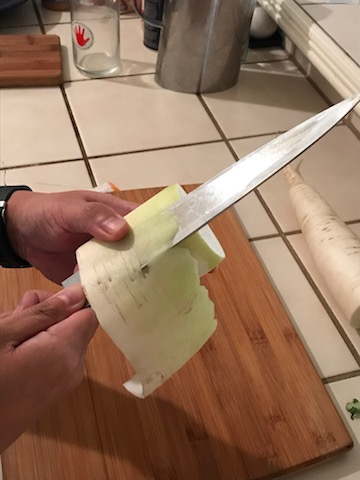
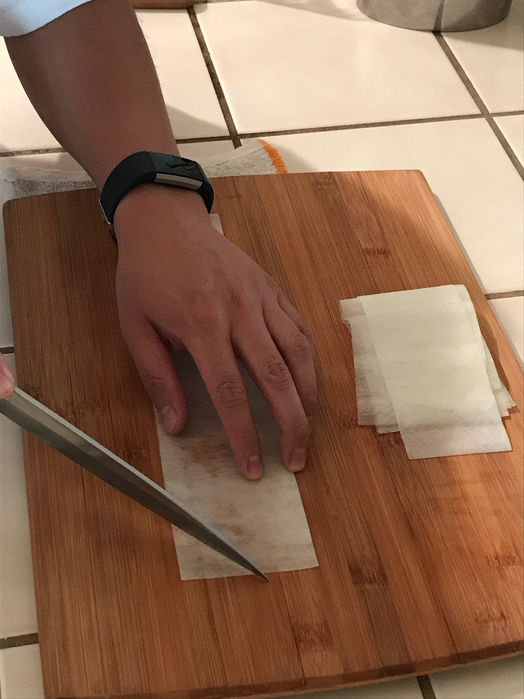
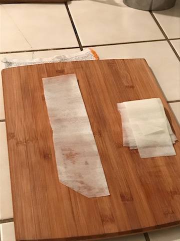
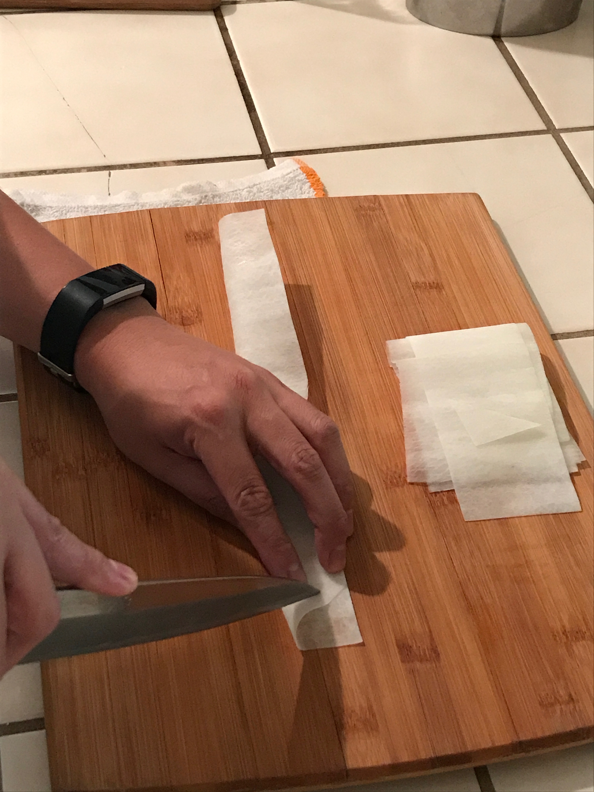
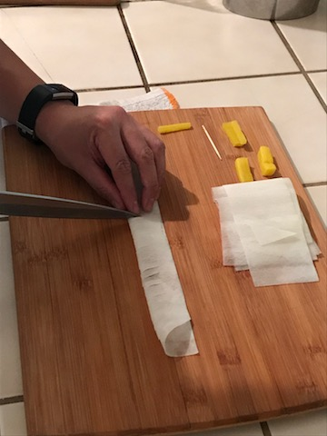
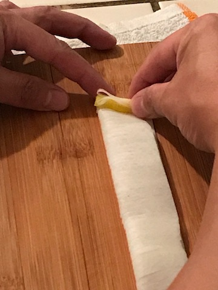
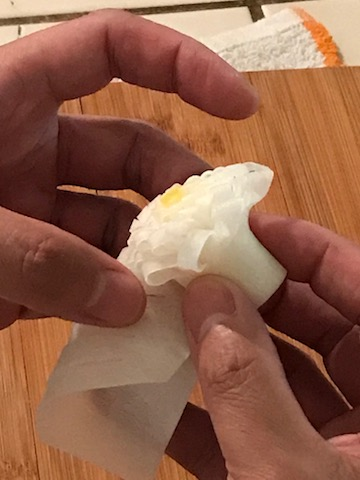
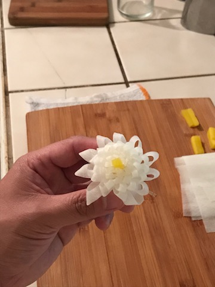
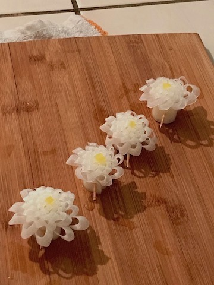

## Advanced Garnish Making
### How to make a flower garnish using a daikon radish

 here's what you need

  <ol>
  <li>cutting board</li>
  <li>a sharp knife</li>
  <li><a href="https://goo.gl/images/3ZWxYm">large daikon radish</a></li>
  <li>a piece of <a href="https://goo.gl/images/HCu8ai">pickled daikon</a></li>
  <li>toothpick</li>
  </ol>
  
Follow these steps

  <ul>
  <li>Slice daikon into 5 inch cyclinders</li>
  
  <li>with your knife, use the katsuamuki technique to carefully remove the outer skin of the daikon; creating a smooth and even surface</li>
  
  <li>use the same technique to create a thin sheet of daikon, 8-10 inches in length</li>
  
  <li>
lay the sheet on the cutting board horizontally, on the right hand side of the sheet cut a triangle with the midpoint of the sheet being the top of the triangle</li>
  
  
  <li>Fold the sheet away from you</li>
  
  <li>looking at where you just cut, find a point 3/4 of the way up and slice towards you, following the angle that the sheet of daikon provides</li>
  
  <li>continue doing this every few centimeters, around midway you should start to transition towards a perpendicular cut, continue this cut until you reach the end of the sheet</li>
  
  <li>on the left hand side place the pickled daikon parallel to your cuts, making sure it's even with the side closest to you </li>
  
  <li>tightly roll the sheet to the right making sure the unfolded edge stays even, at some point it may be easier to pick up the sheet and roll it in your hands</li>
  
  <li>push toothpick through the base</li>
  
  <li>and voila</li>
  
  
</ul>
