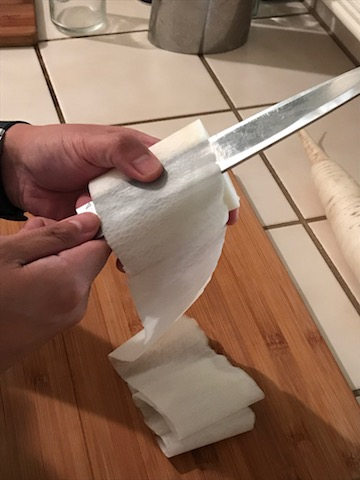
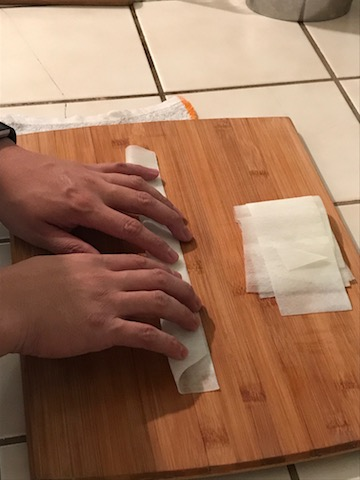
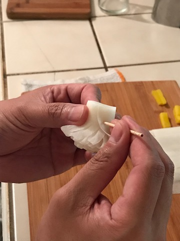

## Advanced Garnish Making
### How to make a flower garnish using a daikon radish

 here's what you need

  <ol>
  <li>cutting board</li>
  <li>a sharp knife</li>
  <li><a href="https://goo.gl/images/3ZWxYm">large daikon radish</a></li>
  <li>a piece of <a href="https://goo.gl/images/HCu8ai">pickled daikon</a></li>
  <li>toothpick</li>
  </ol>
  
  ### Follow these steps
  
<ul>
  <li>Slice daikon into 5 inch cyclinders</li>
  
  <li>with your knife use the katsuamuki technique to carefully remove the outer skin of the daikon; creating a smooth and even surface</li>
  
  <li>use the katsuramuki technique to create a thin sheet of daikon, 8-10 inches in length</li>
  
  <li>
lay the sheet on the cutting board horizontally, on the right of the sheet cut a triangle with the midpoint of the sheet being the top of the triangle</li>
  
  
  <li>Fold the sheet away from you</li>
  
  <li>following the angle of the triangle, find a point 3/4 of the way to the far edge and make a slice towards you</li>
  
  <li>continue doing this every few centimeters, around midway you should start to transition towards a perpendicular cut, continue this cut until you reach the end of the sheet</li>
  
  <li>place the pickled daikon longways on the far left of the folded sheet, making sure it's even with the side closest to you </li>
  
  <li>tightly roll the sheet towards you making sure the far edge remains even</li>
  
  <li>push toothpick through the base</li>
  
  <li>and voila</li>
  
  
</ul>
